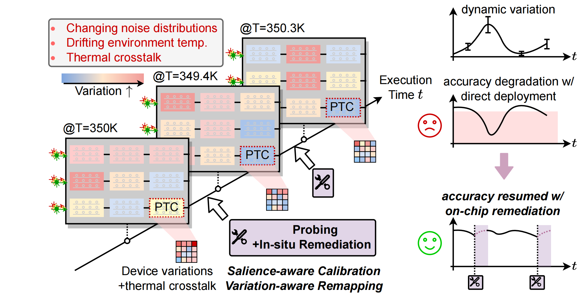
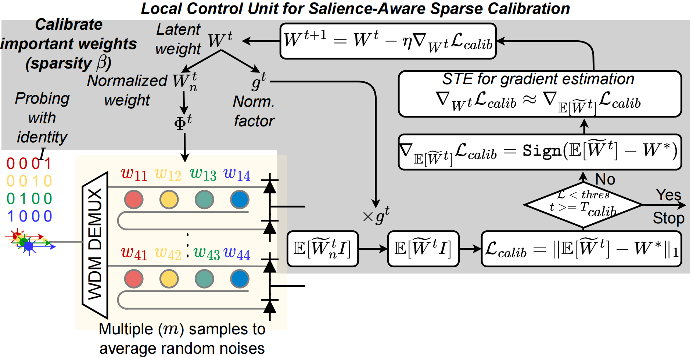
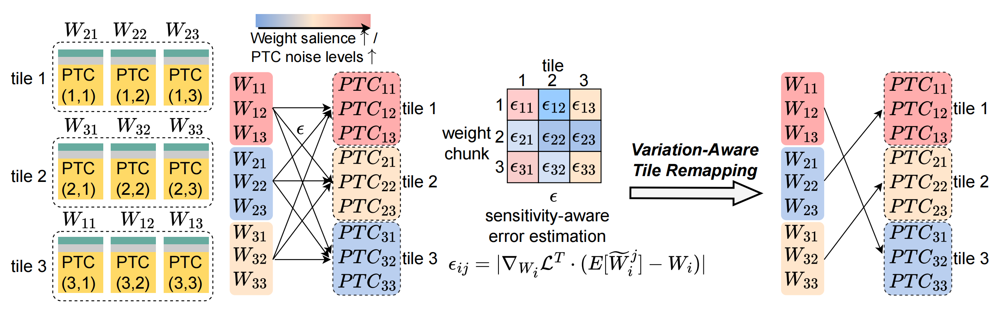

# DOCTOR

By [Haotian Lu](https://github.com/TRIGGERONE), Sanmitra Banerjee and [Jiaqi Gu](https://github.com/JeremieMelo).

This repo is the official implementation of "[DOCTOR: Dynamic On-Chip Temporal Variation Remediation Toward Self-Corrected Photonic Tensor Accelerators](https://arxiv.org/abs/2403.02688)", IEEE Journal of Lightwave Technology, Jun. 2024.

# Introduction
**DOCTOR** is a lightweight dynamic ONN on-chip remediation framework to provide *adaptive* and *in-situ* accuracy recovery against temporally drifting noises.

**DOCTOR** adopts a smart monitor to trigger remediation, then performs training-free *in-situ* sparse calibration to efficiently tune the noisy weights with minimal overhead.
A tile-remapping strategy is integrated into **DOCTOR** to leverage non-uniform and time-variant noise distributions and boost reliability by optimally remapping workloads of higher importance to tensor cores and devices with low noise levels.


**DOCTOR** guarantees sustained performance under drifting variations with **34%** higher accuracy and **2-3 orders-of-magnitude lower overhead** compared with state-of-the-art on-chip training methods when benchmarked on various models and learning tasks.
This synergistic framework is the *first* dynamic, in-situ, and training-free solution that ensures *continued reliability* with *minimal overhead* and further enables self-corrected photonic neural accelerators with unprecedented reliability in real-world, dynamic deployment scenarios.

# Dependencies
* Python >= 3.10
* pyutils >= 0.0.2. See [pyutils](https://github.com/JeremieMelo/pyutility) for installation.
* pytorch-onn >= 0.0.8. See [pytorch-onn](https://github.com/JeremieMelo/pytorch-onn) for installation.
* Python libraries listed in `requirements.txt`
* NVIDIA GPUs and CUDA >= 11.8

# Structures
* core/
    * models/
        * layers/
            * base_layer: Base layer definition; apply different types of noise
            * mrr_conv2d and mrr_linear layers
            * utils.py: Noise schedulers for three types of noise models
        * sparse_bp_\*.py: model definitions
        * sparse_bp_base.py: base model definition; sparse calibration and intra-tile remapping.
    * builder.py: build training utilities
* script/: contains experiment scripts
* train_pretrain.py: training logic, includes noise-free training and noise-aware training 

# Usage
* Pretrain model.\
`> python3 train_pretrain.py config/cifar10/vgg8/pretrain.yml`

* Apply noise on trained models. Please set your hyperparameters in CONFIG=`config/fmnist/cnn3_mrr/pm/Test_all_NI.yml` and run SCRIPT=`script/fmnist/CNN3/Motivation/Test_all_NI.py`\
`> python3 SCRIPT`

* Salience-aware Sparse Calibration and Variation-aware Tile Remapping. Please set your hyperparameters in CONFIG=`config/cifar10/vgg8/pm/sparsity.yml` (e,g, set *algo* as *calib_remap*) and SCRIPT=`script/cifar10/vgg8/mainresult/main_result_ours.py`run\
`> python3 SCRIPT`

* All scripts for experiments are in `./script`. For example, to only run Salience-aware Sparse Calibration, you can write proper task setting in SCRIPT=`script/cifar10/vgg8/main_result.py` (e.g., set *algo* as *calib*) and run\
`> python3 SCRIPT`

* Comparison experiments with Noise-aware Training and On-chip Training methods. Run with the SCRIPT=`script/cifar10/vgg8/mainresult/main_result.py`\
`> python3 SCRIPT`

# Citing DOCTOR
```
@article{lu2024DOCTOR,
  author={Lu, Haotian and Banerjee, Sanmitra and Gu, Jiaqi},
  journal={IEEE Journal of Lightwave Technology}, 
  title={DOCTOR: Dynamic On-Chip Temporal Variation Remediation Toward Self-Corrected Photonic Tensor Accelerators}, 
  year={2024},
  volume={},
  number={},
  pages={1-9}
}
```
